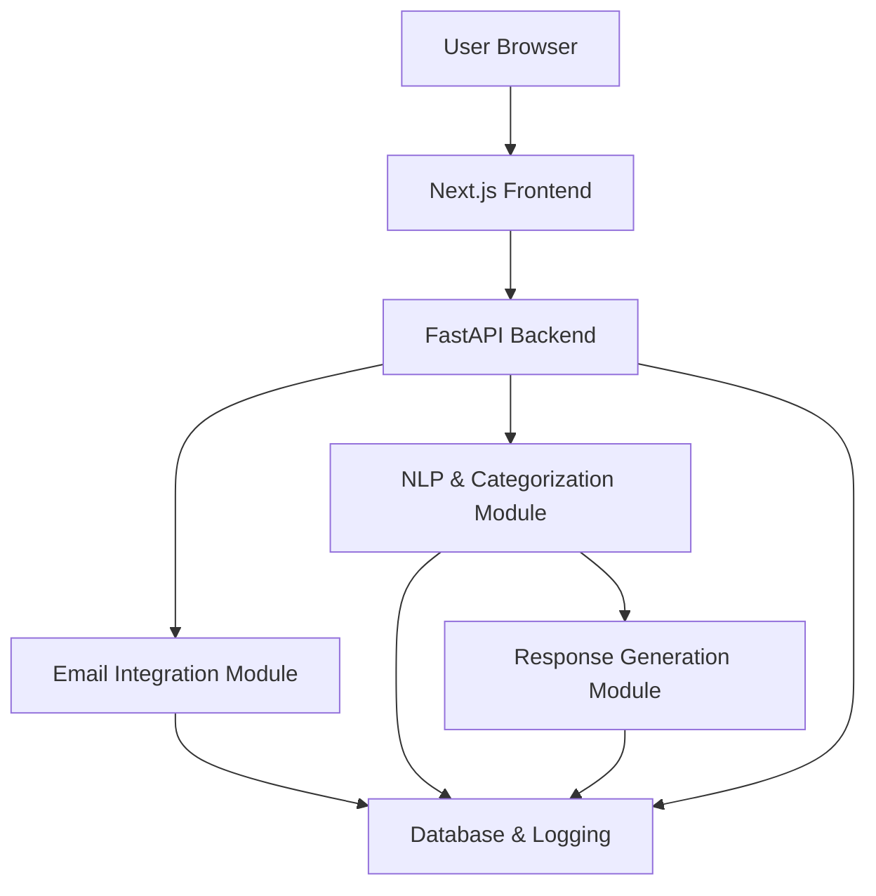

Below is the updated design document with precise technology choices. In this version, the web frontend is implemented using **Next.js** and the backend leverages **FastAPI**. This ensures a clear, unified technology stack across the system.

---

# AI Email Agent Web App – Design Document

## 1. Overview

The AI Email Agent Web App streamlines email management by automatically fetching a user’s emails, categorizing them into predefined buckets (e.g., work, personal, newsletters, urgent), analyzing each message to detect if it requires a response, and prompting the user to review and send a reply. The system leverages email provider APIs, NLP for analysis, and modern web technologies for an engaging user interface.

## 2. Functional Requirements

- **Email Integration:**  
  - Authenticate and connect to email providers (e.g., Gmail, Outlook) using secure OAuth.
  - Fetch emails periodically or on-demand.

- **Email Categorization:**  
  - Parse incoming emails and classify them into categories (e.g., work, personal, promotions, spam).
  - Allow user customization of categories and rules.

- **Response Analysis:**  
  - Use NLP techniques to determine if an email requires a response (e.g., queries, requests, time-sensitive messages).
  - Generate draft responses based on email content and context.

- **User Interaction:**  
  - Display categorized emails in a dashboard.
  - Notify the user of emails that may need a response.
  - Allow users to review, edit, and approve the generated response.
  - Send the approved reply via the email provider’s API.

- **Audit & Logging:**  
  - Log actions such as fetched emails, categorization decisions, response suggestions, and sent emails.
  - Provide an activity history for user review.

## 3. Non-Functional Requirements

- **Security & Privacy:**  
  - Implement secure OAuth for email authentication.
  - Ensure encrypted data transfer (HTTPS) and secure storage for sensitive tokens.
  - Comply with privacy regulations (e.g., GDPR) regarding user data handling.

- **Scalability:**  
  - Design modular components to support increasing email volumes.
  - Use asynchronous processing for email fetching and NLP analysis.

- **Performance:**  
  - Minimize latency in fetching and processing emails.
  - Use caching strategies for frequently accessed data.

- **User Experience:**  
  - Intuitive and responsive UI with clear visual categorization.
  - Provide real-time notifications and actionable insights.

- **Reliability:**  
  - Implement error handling and retries for network/API failures.
  - Ensure high availability through load balancing and redundant services.

## 4. System Architecture

### 4.1 High-Level Architecture Diagram

### 4.2 Component Descriptions

- **Web Frontend (Next.js):**  
  - **Technology Choice:** Next.js  
  - **Description:** The user interface is built using Next.js, which provides server-side rendering and optimized performance. It displays the dashboard where users can view categorized emails, manage settings, and approve response drafts. Next.js allows for rapid development with React components and offers a modern, responsive design.

- **Backend API Server (FastAPI):**  
  - **Technology Choice:** FastAPI  
  - **Description:** The backend is developed using FastAPI, known for its high performance and ease of building RESTful APIs. FastAPI handles all business logic, including authentication, email processing, and integration with external email services. Its asynchronous capabilities ensure efficient handling of email fetching and NLP tasks.

- **Email Integration Module:**  
  - **Description:** Implemented within FastAPI, this module manages OAuth authentication and communicates with email providers via their APIs. It fetches emails and forwards raw data to the processing pipeline for categorization and response analysis.

- **NLP & Categorization Module:**  
  - **Description:** This component processes email content using natural language processing (NLP) to determine categories (e.g., work, personal, spam) and to identify if an email requires a response. It leverages machine learning models integrated within FastAPI.

- **Response Generation Module:**  
  - **Description:** Also part of the FastAPI backend, this module utilizes AI models to generate draft responses based on the context of the email. The generated drafts are then presented on the Next.js dashboard for user review and editing.

- **Database & Logging:**  
  - **Description:** A centralized database is used to store user settings, email metadata, logs of actions, and historical data. Logging components track operations for auditing and troubleshooting. Security measures ensure that sensitive information is encrypted both in transit and at rest.

## 5. Data Flow & Sequence

1. **User Authentication & Email Fetching:**
   - The user logs in via the Next.js interface.
   - OAuth is initiated through FastAPI, with tokens stored securely.
   - The Email Integration Module fetches emails either periodically or on-demand.

2. **Email Processing:**
   - Fetched emails are forwarded to the NLP & Categorization Module.
   - Emails are analyzed and tagged with categories; those requiring a response are flagged.

3. **Response Suggestion:**
   - For flagged emails, the Response Generation Module creates draft responses.
   - FastAPI compiles a summary of actions, including categorization and suggested responses.

4. **User Interaction:**
   - The Next.js dashboard displays categorized emails and pending response suggestions.
   - The user reviews, edits, and approves draft responses.
   - Upon confirmation, FastAPI sends the email using the Email Integration Module.

5. **Logging & Auditing:**
   - All actions are logged in the database.
   - Users can view historical data and activity logs from the dashboard.

## 6. Security Considerations

- **Authentication:**  
  - Secure OAuth 2.0 implementation for email account access.
  - Regular token refresh and proper token revocation handling.

- **Data Protection:**  
  - Encrypted communication using TLS/SSL.
  - Secure API endpoints in FastAPI to prevent unauthorized access.

- **User Permissions:**  
  - Role-based access control if scaling to multiple user roles.
  - Transparent privacy policies and user data management options.

## 7. Future Enhancements

- **Adaptive Learning:**  
  - Enhance NLP models with user feedback for improved categorization and response accuracy.

- **Advanced Customization:**  
  - Provide options for users to define custom categorization rules and response templates.

- **Multi-Provider Support:**  
  - Expand integration to additional email providers and calendar systems.

- **Mobile App:**  
  - Develop mobile-friendly interfaces or native mobile apps for on-the-go email management.

---

This updated design document clearly defines the technology stack, with Next.js for the frontend and FastAPI for the backend, ensuring a cohesive and efficient implementation for the AI Email Agent Web App.
